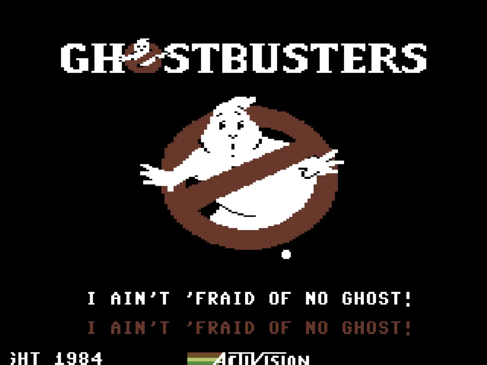

# Ghostbusters

A desktop port of [Ghostbusters](https://www.lemon64.com/game/ghostbusters),
the 1984 Commodore 64 game by David Crane, published by Activision.

Buy equipment, catch ghosts around the city and face Zuul before the city's
psychokinetic energy gets out of control.



## Play

Download the ZIP for your system from the [nightly builds](https://github.com/Haehnchen/c64-ghostbusters/releases/tag/nightly)
and extract it:

- **Windows:** run `ghostbusters.exe`.
- **macOS 13+:** open `Ghostbusters.app`. Choose `arm64` for Apple Silicon or `x86_64` for Intel.
- **Linux:** run `./ghostbusters`. Choose `-bundled.zip` to include runtime libraries.

Wait for the opening speech, then press F1 to start. Enter your name and answer
N to begin with a new account, or Y to enter an existing account number.

## Controls

| Key | Action |
| --- | --- |
| F1 | Start a new game |
| F3 | Resume with the saved account after a completed game |
| Return | Confirm an answer |
| Backspace / Delete | Edit an answer |
| Arrow keys | Move and steer |
| Space | Fire / perform the current action |
| B | Drop ghost bait |
| Pause / Break | Pause or resume gameplay |
| F11 | Toggle fullscreen |
| Escape | Quit |

## Example accounts

Start with F1, enter a name exactly as shown and press Return. Answer Y to
the account question, then enter all eight digits, including leading zeros.
Confirm each entry with Return.

| Name | Account number | Starting balance |
| --- | --- | ---: |
| `VENKMAN` | `00345100` | $20,000 |
| `STANTZ` | `00006400` | $30,000 |
| `SPENGLER` | `00243101` | $50,000 |
| `ZEDDEMORE` | `00040104` | $100,000 |

## Build from source

Requires a C++20 compiler, SDL3 development files, CMake 3.20+, Ninja,
Python 3, Git, Make, pkg-config, Autoconf, Automake and Libtool.
On Windows, use an MSYS2 UCRT64 shell.
The first build needs internet access to fetch the audio dependency.

```sh
make run
```

- `make build` builds the game without starting it.
- `make check` runs the quick tests.
- `make release` creates ZIPs for the current system in `build/release/`;
  it requires an SDL3 development package with the static library.

Built with SDL3 and libresidfp (GPL-2.0-or-later).
